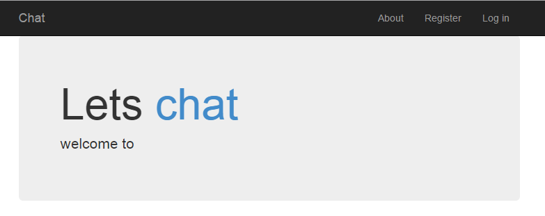

# Welcome

# Oauth google 

https://developers.google.com/apis-explorer/?hl=en_US#p/oauth2/v2/

https://www.googleapis.com/userinfo/v2/me?key={YOUR_API_KEY}

```
Response 200 OK
- Show headers -
{
 "id": "113068305191650837742",
 "email": "",
 "verified_email": true,
 "name": "<>",
 "given_name": "<nick>",
 "family_name": "<>"
 }
```



```
 LetsChatApplication.Controllers.<Register>d__15.MoveNext() in ...SignalChat\src\Controllers\AccountController.cs:155
   System.Runtime.CompilerServices.TaskAwaiter.ThrowForNonSuccess(Task task) +93
   System.Runtime.CompilerServices.TaskAwaiter.HandleNonSuccessAndDebuggerNotification(Task task) +52
   System.Web.Mvc.Async.TaskAsyncActionDescriptor.EndExecute(IAsyncResult asyncResult) +84
   System.Web.Mvc.Async.<>c__DisplayClass37.<BeginInvokeAsynchronousActionMethod>b__36(IAsyncResult asyncResult) +17
   System.Web.Mvc.Async.WrappedAsyncResult`1.CallEndDelegate(IAsyncResult asyncResult) +10
```
   
# LetsChat

http://surajpassion.in/lets-chat-application-using-signalr-in-mvc/